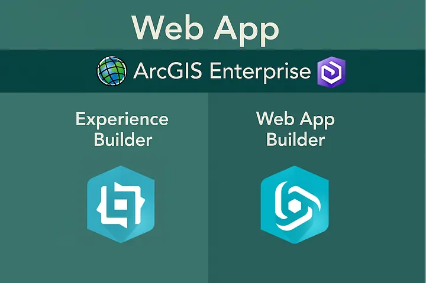
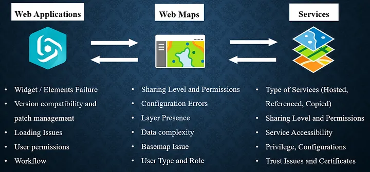

> **Notice:** This is part of the GeoTech Logbook Series. If you are dealing with GIS-based systems, I hope you find some useful insights regardless of your background.

## Introduction

ArcGIS web applications are essential tools for organizations seeking to visualize, analyze, and share spatial data interactively. Two primary platforms — ArcGIS Experience Builder and Web AppBuilder — offer powerful, flexible solutions for building these web apps. However, users frequently encounter challenges during configuration and deployment.

> **Side note:** This is just a glimpse of something much bigger. The aim is to give an overview of how web apps are handled in ArcGIS Enterprise environments.

## Understanding ArcGIS Web Applications

**ArcGIS Experience Builder** enables users to create unique web experiences with flexible layouts, interactive widgets, and support for both 2D and 3D data. It offers drag-and-drop tools, responsive design, and multi-page apps — ideal for modern, mobile-friendly web applications.

**ArcGIS Web AppBuilder** is a WYSIWYG platform for building HTML and JavaScript apps without coding. It provides ready-to-use widgets, configurable themes, and supports both 2D and 3D maps.

| Feature | ArcGIS Experience Builder | ArcGIS Web AppBuilder |
|---|---|---|
| Layout Flexibility | Highly flexible, drag-and-drop | Theme-based, WYSIWYG |
| Widget Customization | Advanced, supports custom widgets | Ready-to-use, limited |
| 2D/3D Support | Both in one app | 2D or 3D separately |
| App Structure | Multi-page, dynamic | Single or multi-page |
| Migration Path | Recommended for all new apps | Legacy, still supported |
| Underlying Technology | ArcGIS Maps SDK for JS 4.x | ArcGIS API for JS 3.x |

## Building and Troubleshooting Workflows

Understanding how Web Applications are constructed is essential for effective troubleshooting. The key insight is the layered relationship between services, web maps, and applications.

**From left to right** — the diagram illustrates the troubleshooting workflow: starting with the web application, then moving to the associated web map(s), and finally examining the layers or services that compose those web maps.

**Conversely, from right to left** — it illustrates the building workflow, showing how web applications are developed beginning at the services level, progressing to the web map, and culminating in the final application.

Remember that permissions, sharing settings, user types, and roles apply across all levels.

## Guide to Common Errors

### Error 1: Creating Map Failed

**Possible Causes:**
- Inappropriate sharing level of the map from Portal for ArcGIS
- Broken or corrupted ArcGIS Experience Builder
- Web map is corrupted, broken, or deleted

**Possible Solutions:**
- Change the sharing level of the web map (Organization/Public): Portal → Content → Select Web Map → Edit Sharing
- Replace the Web Map in Experience Builder: Open App → Map widget → Content → Replace Web Map → Save → Publish
- Ensure all data sources are properly bound and loaded

[Knowledge Article: Creating Map Failed](https://support.esri.com/en-us/knowledge-base/problem-the-web-map-is-not-available-in-the-map-widget--000031842)

### Error 2: Unable to Toggle Layer Visibility in Map Layers Widget

**Possible Causes:**
- "Interact with a Map widget" option not selected
- "Toggle layer visibility" not enabled

**Solutions:**
- Enable the necessary options in the Map Layers widget: Insert widget → Map Layers → Content → Select "Interact with a Map widget" → Enable "Toggle layer visibility" → Save/Publish
- Use the Map Widget as the source of the Map Layers widget

[Knowledge Article: Toggle Layer Visibility](https://support.esri.com/en-us/knowledge-base/problem-unable-to-toggle-the-visibility-of-the-map-laye-000028614)

### Error 3: No Editable Layers Found

**Possible Root Causes:**
- Layers are not editable
- User does not have the appropriate role for editing (viewer role)

**Recommended Fixes:**
- Allow edits on all feature layers: Portal → Content → Item details → Settings → Enable editing
- Change the user's role to one with editing privileges: Portal → Organization → Members tab → Change Role

[Knowledge Article: No Editable Layers Found](https://support.esri.com/en-us/knowledge-base/problem-the-editor-widget-is-empty-in-arcgis-experience-000031809)

### Other Tips

- Ensure all web maps and feature services are shared with the intended audience.
- Check for version mismatches between custom widgets and the Experience Builder framework.
- Update browsers and clear cache to resolve client-side issues.
- Verify correct manifest URLs for custom widgets.

## Best Practices for Reliable ArcGIS WebApps

- Regularly review sharing settings for all data sources and apps.
- Test apps in multiple browsers and devices — Incognito mode is worth testing for browser-specific issues.
- Document configuration changes and maintain version control.
- Monitor Esri's release notes for updates, bug fixes, and breaking changes.
- Use roles and privileges appropriately to control editing and data access.
- Always save a snapshot and back up configurations before major updates or migrations.

## Conclusion

ArcGIS Experience Builder and Web AppBuilder are robust platforms for building interactive web mapping applications. By following structured troubleshooting workflows, understanding common errors, and applying best practices, you can minimize downtime and deliver reliable, user-friendly web apps.

## References & Further Reading

- [ArcGIS Experience Builder — Esri Products](https://www.esri.com/en-us/arcgis/products/arcgis-experience-builder/overview)
- [ArcGIS Web AppBuilder — Esri Products](https://www.esri.com/en-us/arcgis/products/arcgis-web-appbuilder/resources)
- [Manage Members — ArcGIS Enterprise](https://enterprise.arcgis.com/en/portal/latest/administer/windows/manage-members.htm)
- [Configure Map Layers Widget — ArcGIS Enterprise](https://doc.arcgis.com/en/experience-builder/latest/configure-widgets/map-layers-widget.htm)

*"GIS enables us to analyze geographic data and make informed decisions."* — Jack Dangermond
