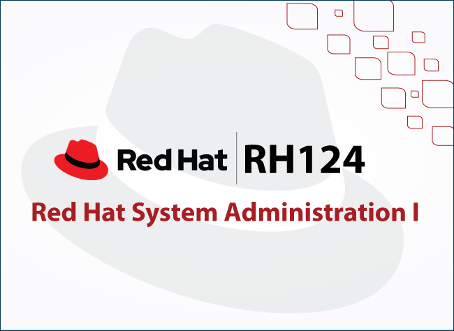
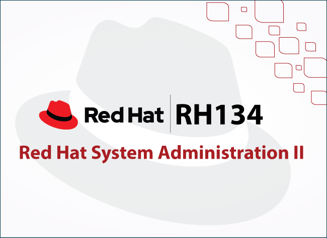
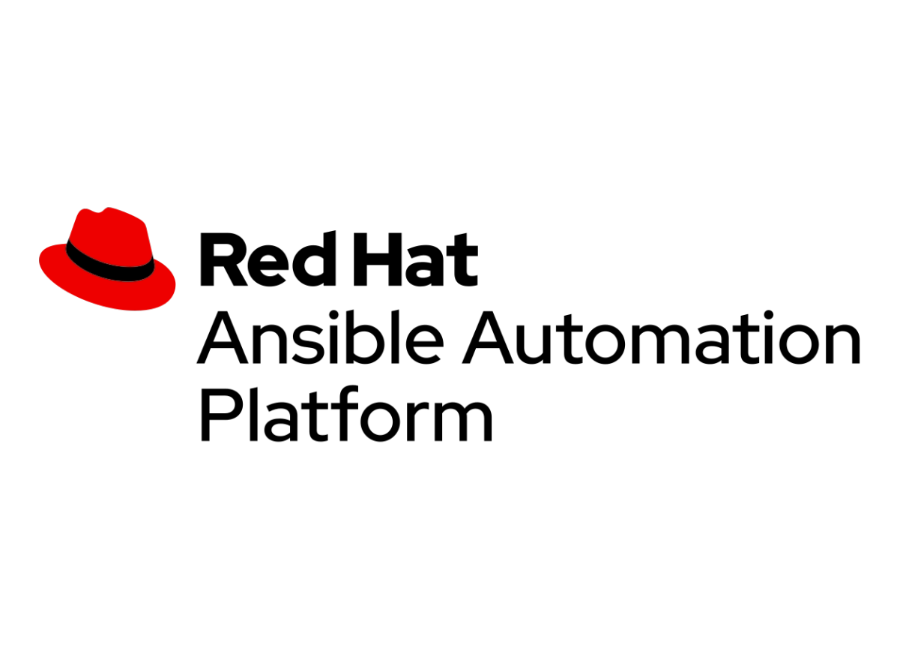

## Introduction

Linux is a very common topic nowadays in the world of software development, system administration, DevOps, database management, and security operations. In this blog, I tried to cover as much as I could — not only on RH124, RH134, and DO457 — but also on Linux in general, highlighting useful materials and resources for future reference.

**Disclaimer:** It's crucial to understand your learning style then adapt to what is most convenient for yourself. There are several ways to learn and master Linux — whether from official documentation, YouTube channels, or third-party providers. Feel free to share and recommend more tips and materials. Let's dive in!

## System Administration I (RH124)

RH124 is an introductory course covering the fundamental skills needed to manage and administer Red Hat Enterprise Linux systems. Key topics covered:

1. **Linux Essentials** — Command-line basics, file system navigation, and text file manipulation.
2. **User & Group Management** — Creating, modifying, and managing users, groups, and permissions.
3. **Software Management** — Installing, updating, and removing packages using RPM/YUM/DNF.
4. **System Services & Logging** — Managing systemd services, checking logs with journalctl, and troubleshooting.
5. **Basic Networking & Storage** — Configuring IP addresses, mounting storage, and using partitions.

## System Administration II (RH134)

RH134 builds on RH124 and dives deeper into advanced system administration topics. Key concepts:

1. **Advanced User & Group Management** — sudo privileges, ACLs, and SELinux policies.
2. **Storage Management** — LVM, disk partitioning, mounting file systems, and swap management.
3. **Networking & Firewalls** — Configuring network interfaces, troubleshooting, and managing firewall rules.
4. **Process & Performance Management** — Monitoring resource usage, scheduling tasks with cron/systemd timers.
5. **System Automation & Scripting** — Writing Bash scripts to automate administration tasks.

## Network Automation with Ansible (DO457)

DO457 focuses on automating network management tasks using Ansible. Key points:

1. **Introduction to Ansible** — Setting up Ansible, preparing for development, and managing inventories.
2. **Playbook Development** — Writing, running, and troubleshooting Ansible playbooks.
3. **Variables & Facts** — Managing variables, gathering facts, and using surveys to configure systems.
4. **Task Control** — Implementing loops, conditionals, and handling task failures in playbooks.
5. **Network Automation** — Simplifying network administration with roles, templates, and platform-independent modules.

## Valuable Resources & Materials

### General Purpose Resources

- **[Linux Journey](https://labex.io/linuxjourney)** — Descriptive, non-practical documentation useful to refresh knowledge or get a basic understanding of Linux. Free of charge.

- **[NetworkChuck — Linux for Hackers](https://www.youtube.com/watch?v=VbEx7B_PTOE&list=PLIhvC56v63IJIujb5cyE13oLuyORZpdkL)** — Chuck Keith creates engaging content about IT, Linux, Networking, and Cybersecurity. This series was invaluable when I first started learning Linux. He uses HackTheBox VMs to demonstrate everything — you can do the same to skip the hassle of setting up a VM. He also covers [Ansible](https://www.youtube.com/watch?v=5hycyr-8EKs).

### Security-Focused Resources with Hands-On Labs

- **[TryHackMe — Linux Fundamentals](https://tryhackme.com/module/linux-fundamentals)** — Beginner-friendly, highly recommended for anyone starting from scratch. Part 1 is free; Parts 2 and 3 are premium.

- **[HackTheBox](https://academy.hackthebox.com/)** — Intermediate to advanced content. Not recommended for absolute beginners, but excellent once you have fundamentals. [$8/month student pricing](https://help.hackthebox.com/en/articles/5720974-academy-subscriptions).

- **[OverTheWire — Bandit](https://overthewire.org/wargames/bandit/)** — Gamified Linux CTF platform. Each challenge's password is hidden in the previous challenge's flag. Free of charge.

### RHCSA Certification Prep Resources

- **[Red Hat Academy / RHCSA EX200](https://www.redhat.com/en/services/training/ex200-red-hat-certified-system-administrator-rhcsa-exam)** — I had the privilege of being granted access to RH124, RH134, and DO457 materials through my student email. The courses come with 60 hours of lab time and guided exercises throughout each chapter.

- **[RHCSA Guru](https://rhcsa.guru/pricing/)** — Arguably one of the best RHCSA EX200 prep resources available. Covers RHCSA, RHCSA+, and RHCE (Ansible). Powered by a sandbox for hands-on labs. Premium ($19/month) or Premium+ ($29/month).

- **[Labex](https://labex.io/pricing)** — Beginner to intermediate platform covering Linux (including RHCSA), programming, and more. Also powered by a sandbox.

- **[CBT Nuggets](https://www.cbtnuggets.com/)** — Online IT training platform with video-based courses for networking, cybersecurity, cloud, and programming. Includes hands-on labs and practice exams. $59/month.

## Final Reflections

Mastering Linux, System Administration, and automation tools like Ansible is an essential skill for anyone pursuing a career in IT, Security, or DevOps.

In my opinion, the best way to get your hands really dirty is a full installation and setup from scratch. However, everyone starts somewhere — begin with **browser-based sandboxes**, then move to a **beginner-friendly distro** such as Ubuntu, Parrot OS, or Kali Linux, then migrate to more complex distributions with a higher learning curve such as **Arch Linux**.

Whether you're tackling RHCSA exams, diving into hands-on labs, or seeking practical Linux challenges, there's a wealth of resources available to sharpen your skills and make you a Linux expert.

[View My Certificates of Completion for RH124, RH134 & DO457](https://drive.google.com/drive/folders/1K9sY6HHdvuxy_DL0nEG3DTbpl_Lamnv5?usp=sharing)
