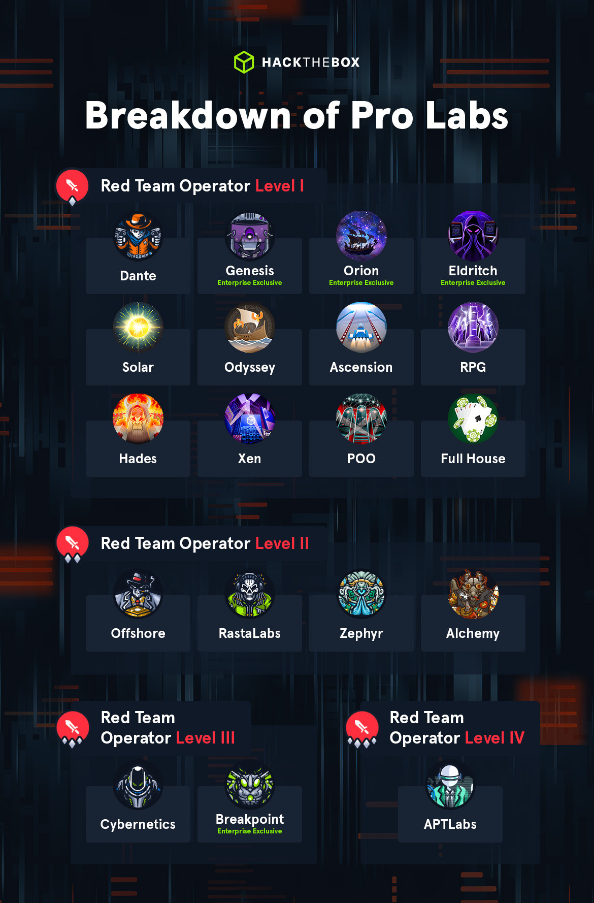
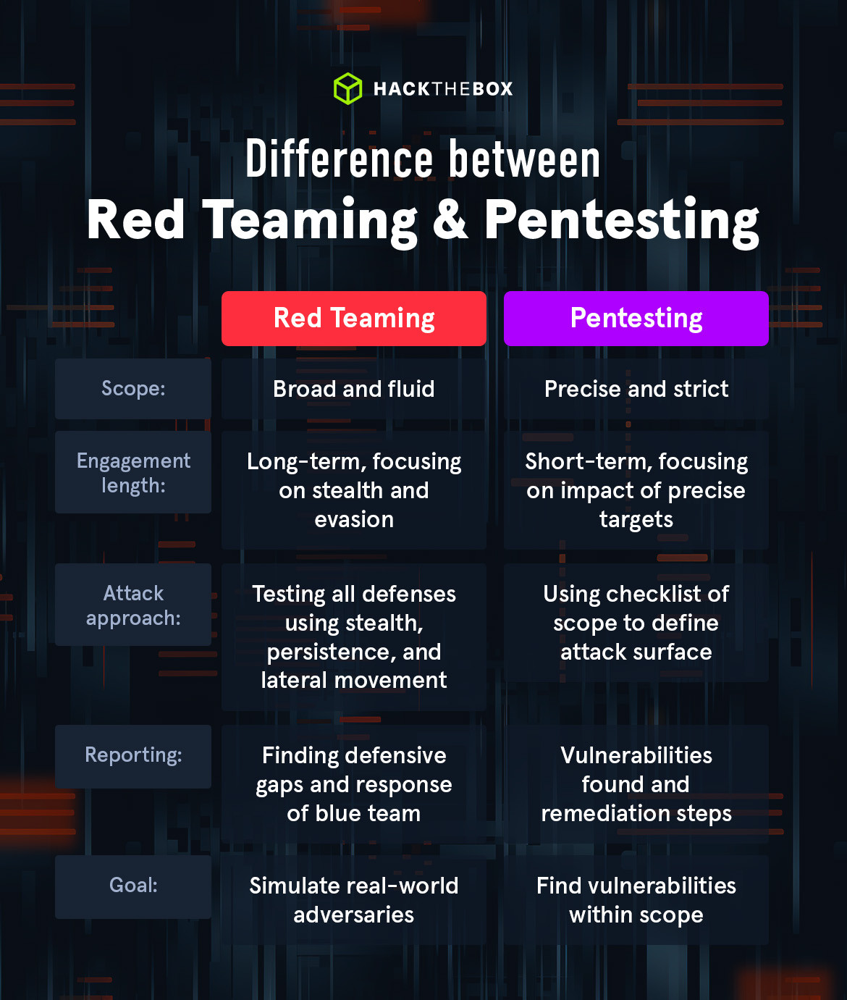
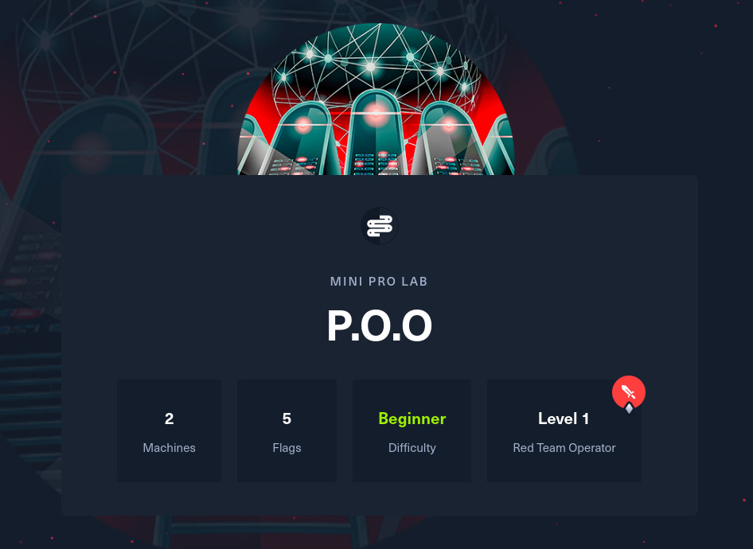
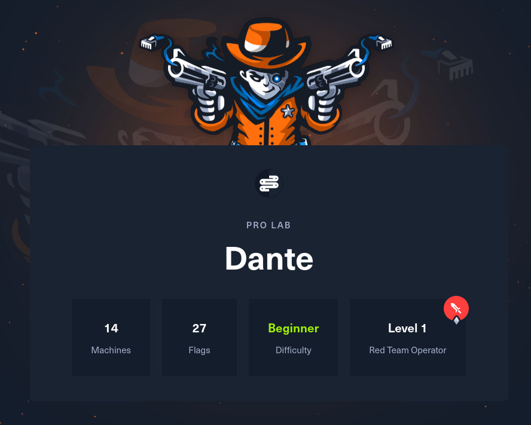
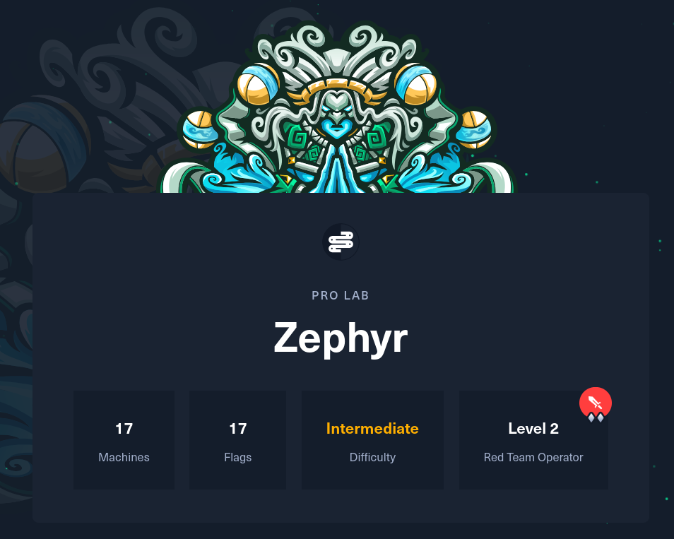
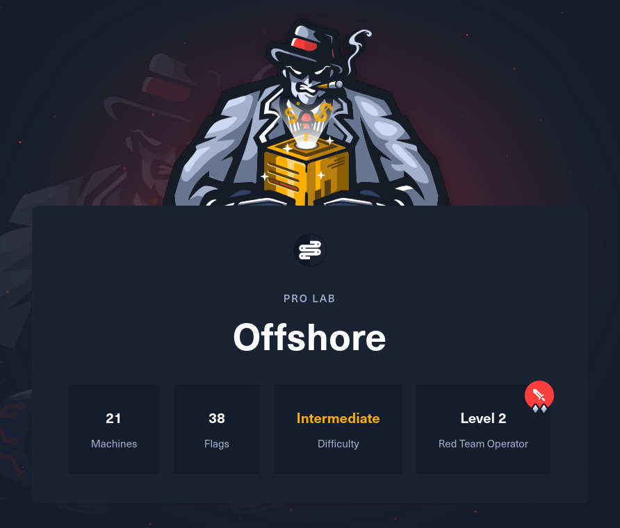

## Introduction

HackTheBox Pro Labs have become a defining benchmark in cybersecurity training, offering immersive, real-world simulation environments designed to push the boundaries of ethical hacking skills. These labs are highly valued by cybersecurity professionals for their realism, complexity, and advanced setup with the latest TTPs.

In this blog post, we will dive into the meat and potatoes of 3 major Pro Labs (Dante, Zephyr, Offshore) and POO mini Pro Labs — highlighting their core challenges, learning outcomes, and what makes each lab a unique training ground. Whether you're a seasoned professional or a novice seeking a challenge, I hope this guide brings some clarity and helps you decide which Pro Labs to tackle next.

## Quick Overview of Pro Labs Categories

Before dissecting the mentioned Pro Labs individually, it's essential to have a sneak peek of what they are made of, their purpose, as well as applicability. There are 2 main categories:

- **The Primary Bundle:** grants access to all Pro Labs shown on the cover image of this post. More details on pricing can be found [HERE](https://www.hackthebox.com/blog/pro-labs-update).
- **Enterprise Exclusive:** comes under a different subscription. Feel free to explore for more details.



## Are Pro Labs Designed for Red Team Operators or Penetration Testers?

At first, I thought HackTheBox Pro Labs were only for Red Team operators — turns out I was wrong. Most labs are Red Team–level, and while shortcuts can work, it's best to follow the intended approach. Relying on shortcuts or luck might work at times but would never fly in real engagements. Everything in the lab exists for a reason, so stay observant and take detailed notes.

Despite the name, penetration testers can tackle these labs and practice, if not learn new skills or techniques. Bear in mind that they are time-consuming, even for seasoned professionals. This could be due to factors like tools malfunctioning, VPN issues, broken machines, or overlapping attacks. Frustrating moments such as **"Why won't this payload work?"** are unavoidable.



> **Note:** The overviews and learning outcomes below are exactly as described on the [HTB Pro Labs page](https://www.hackthebox.com/hacker/pro-labs). Everything else is my personal opinion and experience. I will try my very best not to throw spoilers.

## P.O.O Mini Pro Labs



### Overview

P.O.O focuses on enumeration, lateral movement, and privilege escalation within small Active Directory environments configured with the latest operating systems and technologies. The goal is to compromise the perimeter host, escalate privileges, and ultimately compromise the domain.

### Learning Outcomes

- Enumeration
- Active Directory enumeration and attacks
- Pivoting & Lateral Movement
- Local privilege escalation
- Situational awareness
- Web application enumeration and attacks

### Key Takeaways & Insights

- Difficult to elaborate without spoiling, but if you want to get familiar with HTB Enterprise Networks at the smaller scale, this is a great warm-up. Starting with this was instrumental for me — the difficulty keeps escalating as you move forward.
- I found the attack paths very interesting and enumerated these machines in ways I never thought I could. Long story short, it won't be a waste of time even though you only get 5 flags to capture. P.O.O is a Pro Lab for a reason, hence I will let you discover it.

## Dante Pro Labs (AKA The Pivot Playground)



### Overview

Dante is a modern, beginner-friendly Pro Lab that provides the opportunity to learn common penetration testing methodologies and gain familiarity with tools included in the Parrot OS Linux distribution.

### Learning Outcomes

- Enumeration
- Exploit development
- Pivoting & Lateral Movement
- Local privilege escalation
- Situational awareness
- Web application attacks

### Key Takeaways & Insights

- Dante focuses on network-level penetration testing. Some find it chaotically messy, while others enjoy navigating its pitfalls.
- **PoC** and **Exploits** are all over **ExploitDB**, **GitHub**, hence a little hint will put you on the right path. Google is your best ally.
- **Ligolo-ng** is essential for navigating subnets and pivoting, outperforming tools like **ProxyChains**, **SSH tunnels**, or **Chisel**. Still, sometimes **Chisel** works better for specific hosts.
- A junior penetration tester with strong methodology and patience can tackle Dante, but success depends on experience. While it covers little AD exploitation, it's excellent for practicing pivoting, understanding enterprise network setups, and sharpening engagement skills.

## Zephyr Pro Labs (AKA The Calm Before the Storm)



### Overview

Zephyr is an intermediate-level red team simulation environment, designed to be attacked as a means of learning and honing engagement skills, improving Active Directory enumeration and exploitation.

### Learning Outcomes

- Enumeration
- Evading endpoint protections
- Exploitation of a wide range of real-world Active Directory flaws
- SQL & Relay Attacks
- Lateral movement and crossing trust boundaries
- Privilege escalation
- Web application attacks

### Insights and Reflections

- Several reviews suggest Zephyr is excellent for CRTP holders and exam prep. The latest syllabus includes using Sliver C2 on Windows Server 2022, which is invaluable. Leveraging a C2 could make handling AV/EDR much easier.
- Many CPTS veterans note that Zephyr aligns well with the HTB CPTS exam. Dante and Zephyr are often the top two Pro Labs recommended before attempting CPTS. While Offshore is considered overkill, doing it wouldn't hurt.
- While the **CPTS learning path** felt sufficient, I found the overall experience incredibly rewarding — learning new tricks and TTPs along the way.

## Offshore Pro Labs (AKA Trust Terror)



### Overview

Offshore is a real-world enterprise environment featuring a wide range of modern Active Directory misconfigurations. Once you breach the perimeter and gain a foothold, you are tasked to explore the infrastructure and attempt to compromise all Offshore Corp entities.

### Learning Outcomes

- Active Directory enumeration and exploitation
- Evading endpoint protections
- Lateral movement
- Local privilege escalation
- Situational awareness
- Tunneling and pivoting
- Web application enumeration and attacks

### Lessons Shaping the Path Forward

- Offshore is time-consuming, especially without CRTE, CRTM, CRTO, CRTL, or HTB CAPE. You can certainly do it without those certs — but be ready to be humbled several times, to embrace extreme resilience and composure, and to do extensive research. If you've been through HTB Pro Labs before, you know the drill.
- **BloodHound** is essential for mapping the landscape, especially with four forests. Map each domain and forest thoroughly to understand trust relationships and uncover valuable insights.
- A key tip: switching VPN instances can make unreachable hosts accessible. Many users suggest US over EU instances, partly because some stay broken for days.
- Offshore is vast, chaotic, and demanding, but truly rewarding. Cybernetics and RastaLabs (AKA Evasion Madness) are tougher — their strict evasion requirements mean msfvenom alone won't save you without proper obfuscation techniques.
- If Dante felt messy, Offshore will blow your mind — flags are everywhere. Thoroughly enumerate every host, and search for strings like `flag`, `OFFSHORE`, or similar. I ran the below command on nearly every host, and it saved me more than once:

```powershell
powershell.exe -c "Get-ChildItem -Path C:\ -Recurse -Filter *flag*.txt -ErrorAction SilentlyContinue -Force"
```

## Final Thoughts, Tips and Recommendations


- The labs often have many active users, so expect overlapping techniques. ForceChangePassword is frequently used (thanks to BloodHound) and often by novices, while experienced players take other routes. Artifacts, hashes, or deleted files may also result from others' actions.
- Establish a solid methodology before starting, or refine one as you progress. CPTS gave me the fundamentals, but success with HTB Labs demands research and resourcefulness. Use Google, the HTB Community, Forum, and Discord.
- Sometimes it's best to capture or steal credentials instead of brute-forcing them (**Responder**, **SMBRelay**, or **OSINT** are instrumental). Credential reuse is common across these labs so familiarity with **NXC** or **CME** can save a lot of time.
- Enumeration is key. Run tools like **winPEAS**, **LinPEAS**, or living-off-the-land techniques to locate interesting files and attack paths.
- Engage wisely with the community — Discord is your best ally. Check the Pro Labs section for past discussions when stuck. Many solutions come from reading, sharing, or helping others.
- Take detailed notes and track all findings. Some even practice reporting, which is great. Whatever method you use — never **CHARGE IN BLIND**.
- You don't need to master C2 frameworks for all Pro Labs, though they shine in Zephyr, RastaLabs, and Cybernetics. For POO and Dante, they're overkill. Focus on mastering **Ligolo-ng** for pivots, it remains far more reliable than Proxychains, Chisel, or SSH.
- Be ready to step out of your comfort zone. You will need to use unfamiliar TTPs.
- Automate wherever possible. Here's a bash script I use to add hosts to a Ligolo interface:

```bash
#!/bin/bash
# Interface to use
INTERFACE="ligolo"
# List of target IPs
IPS=(
    172.16.x.x
    172.16.x.x
    172.16.x.x
)
# Loop through each IP and add route
for ip in "${IPS[@]}"; do
    echo "Adding route to $ip via $INTERFACE..."
    sudo ip route add "$ip" dev "$INTERFACE"
done
echo "All routes added successfully."
```

## References

- [The Hacker Recipes](https://www.thehacker.recipes/)
- [Hacktricks — Wiki](https://book.hacktricks.wiki/en/index.html)
- [AD Exploitation Cheat Sheet](https://github.com/S1ckB0y1337/Active-Directory-Exploitation-Cheat-Sheet)
- [Pre-Compiled Binaries](https://github.com/jakobfriedl/precompiled-binaries/tree/main)
- [AD PenTesting Tools](https://github.com/theyoge/AD-Pentesting-Tools)
- [Awesome AD PenTest Tools](https://github.com/CyberSecurityUP/Awesome-Active-Directory-PenTest-Tools)
- [Introduction to Enterprise Level Attack Scenario — HTB Blog](https://www.hackthebox.com/blog/new-pro-labs-offerings)
- [HackTheBox Pro Labs Overview & Learning Outcomes](https://www.hackthebox.com/hacker/pro-labs)
- [HTB Labs Subscriptions](https://help.hackthebox.com/en/articles/7257535-htb-labs-subscriptions)
- [HTB Pro Labs Deep Dive — LinkedIn](https://www.linkedin.com/pulse/htb-pro-labs-deep-dive-realistic-penetration-testing-ewerson-w19qf/)
