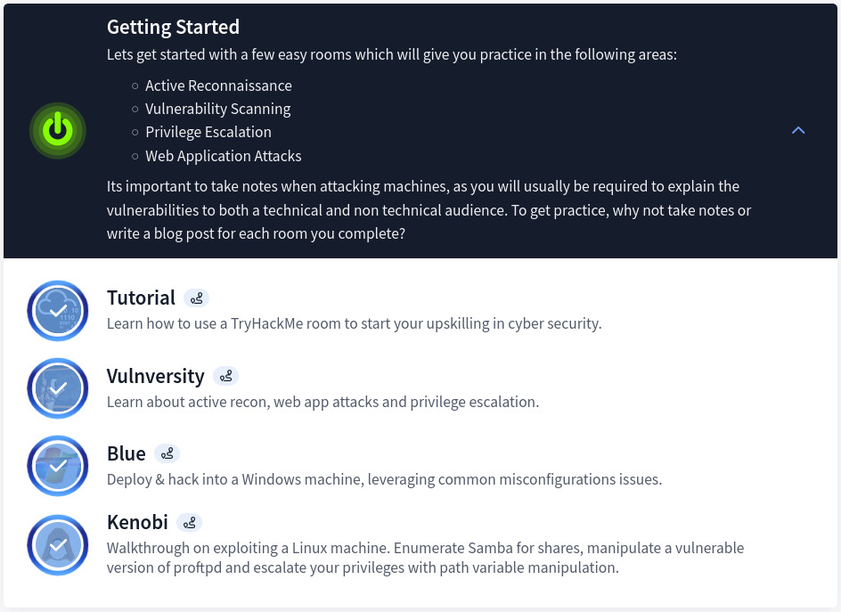
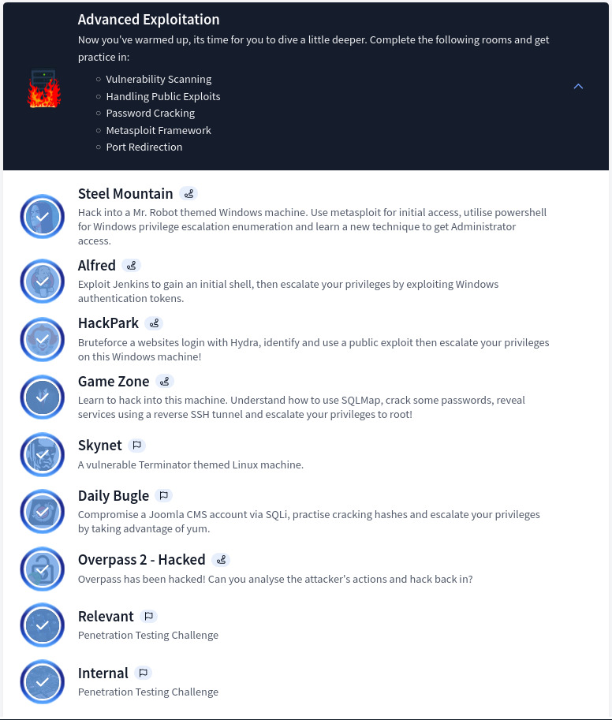
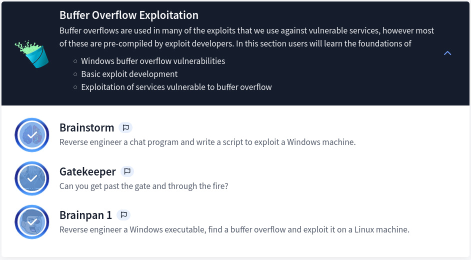
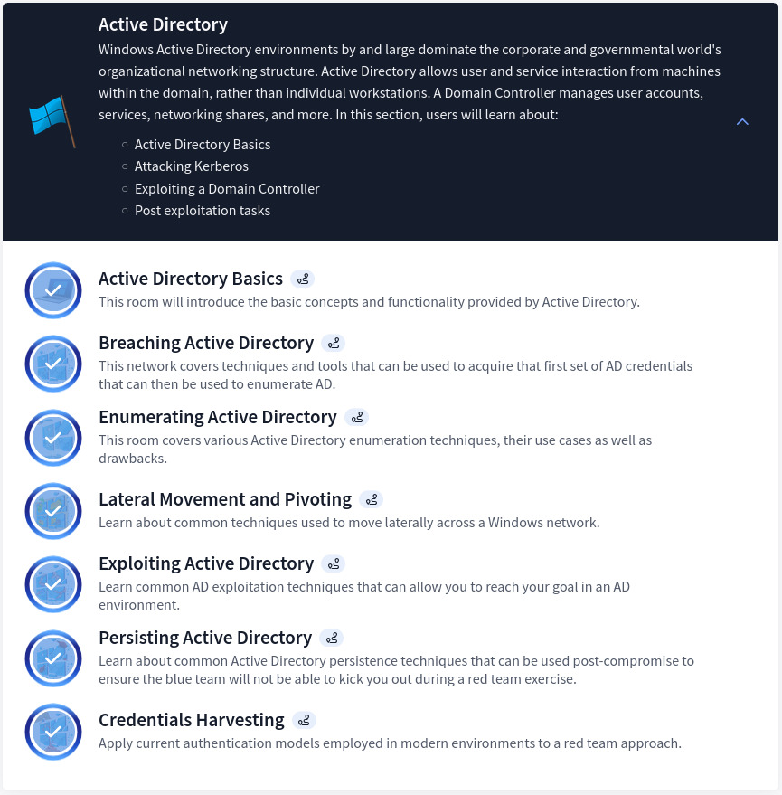
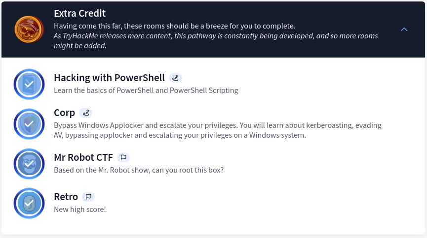

## Overview

In my journey of sharing experiences about TryHackMe learning paths, here is another blog covering the Offensive Pentesting Path. This path's main deliverable is to equip individuals with essential penetration testing skills, focusing on practical labs in web applications and network security. The path also highlights industry-standard tools and methodologies to find vulnerabilities, preparing learners for real-world testing and certifications.

## Section 1: Getting Started

Designed with ease and simplicity, this section gives a step-by-step walkthrough on how to connect to VPN, perform basic enumerations, exploitation, and privilege escalation. A great foundation for anyone new to the field.

## Section 2: Advanced Exploitation

Fun, challenging, and rewarding — this section is blended with multiple CTF-based challenges where many tools, techniques, and methodologies can be utilized to pwn each machine.

## Section 3: Buffer Overflow Exploitation

New to buffer overflow vulnerabilities and exploitation, I learned a lot in the process. The course is covered in more depth on HackTheBox WinBOF and LinBOF learning paths.

## Section 4: Active Directory

This section covers all the basics — enumeration, exploitation, pivoting, tunneling, and credential harvesting. It might seem like a lot at first, but there is much more to learn on AD. The HTB AD Learning Path covers every aspect of it comprehensively.

## Section 5: Extra Credit

Challenging for some, less so for others — but definitely worth your time as you might come across something new.

## Key Deliverables

1. **Familiarity with Penetration Testing Methodologies** — Structured approach to vulnerability assessments including reconnaissance, exploitation, and post-exploitation tactics.
2. **Hands-On Skill Development** — Proficiency with tools such as Metasploit, Burp Suite, Nmap, Hydra, BloodHound, and custom scripts. Enhanced critical thinking and problem-solving abilities.
3. **Certification Preparation** — Solid foundation for pursuing industry-recognized certifications such as eJPT, eCPPT, CPTS, OSCP, or CEH.

## Final Tips and Tricks

1. **Master The Basics** — Ensure a good understanding of IP Addressing, protocols (TCP/UDP), common services, and fundamentals of Windows and Linux. This significantly eases the learning curve.
2. **Leverage Resources Fully** — Labs are designed to put theory into practice. Keep notes in Notion, Obsidian, or GitHub.
3. **Follow a Methodology** — Learn about MITRE ATT&CK, OWASP, PTES, PCI DSS, NIST 800-115, and OSSTMM.
4. **Practice, Practice, Practice** — Apply skills on THM, HTB, VulnHub, or Proving Grounds. Try everything before checking write-ups — and when you do, understand the methodology. *"If you don't fail, you're not even trying."* — Denzel Washington

[View My Certificate of Completion](https://tryhackme-certificates.s3-eu-west-1.amazonaws.com/THM-XGYYH1NQ3X.pdf)
