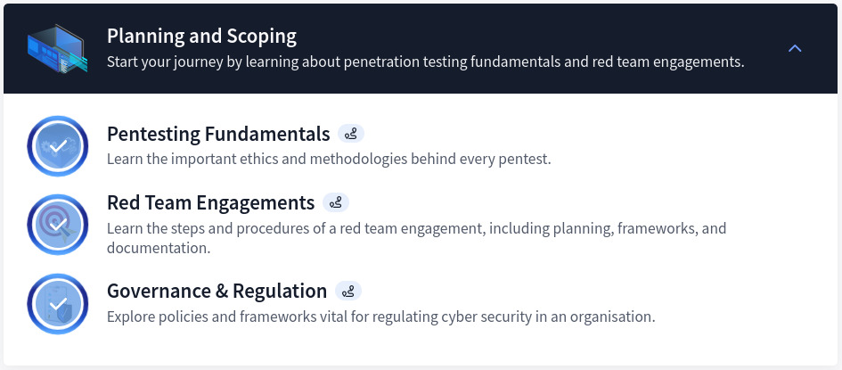
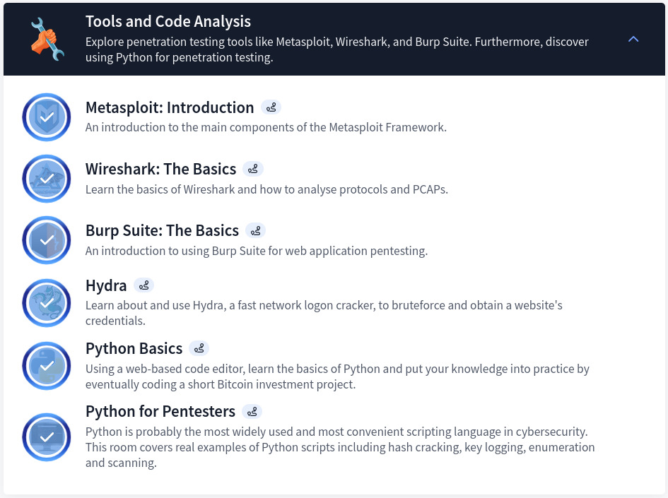
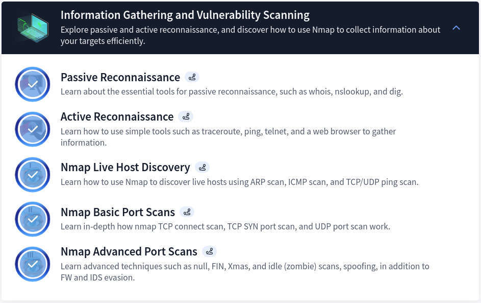
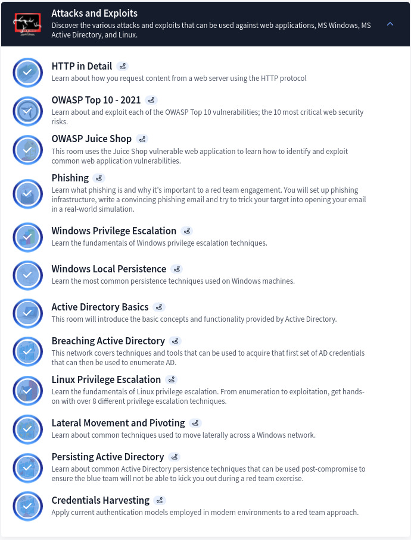

## Introduction

The CompTIA PenTest+ pathway helps learners build practical skills for penetration testing and vulnerability assessment. While I lack direct experience with the PenTest+ exam itself, this pathway offers hands-on labs and exposure to key tools, techniques, and post-exploitation tactics relevant for offensive security.

## Section 1: Planning and Scoping

Focuses on the foundations of penetration testing — project planning, scoping engagements, and understanding governance and regulations. Valuable insights into setting clear objectives, identifying client needs, and aligning with legal frameworks.

> **Disclaimer:** It is crucial to understand everything and have full permission before engaging in any form of assessment.

## Section 2: Tools and Code Analysis

Introduces key tools such as Metasploit, Wireshark, Burp Suite, and Hydra. Also integrates Python programming basics and its application in PenTesting.

> **Note:** It's important to fully grasp the basics of each tool to use it for high-level assessments.

## Section 3: Information Gathering and Vulnerability Scanning

Covers passive and active reconnaissance, host discovery, and advanced scanning methods using Nmap to uncover potential weaknesses.

> **Note:** You can use different tools for the same purpose — Rustscan and Naabu are great alternatives.

## Section 4: Attacks and Exploits

Real-world attack scenarios simulated on both Windows and Linux, including Active Directory exploitation. Time consuming but yet rewarding.

> **Note:** The same modules are also covered in the Offensive PenTesting and Red Teaming pathways.

## Core Deliverables

1. **Planning and Scoping** — Define PenTesting goals, scopes, and legal compliance (GDPR, HIPAA).
2. **Tools and Code Analysis** — Working knowledge of Metasploit, Wireshark, Burp Suite, Hydra, and Python scripting.
3. **Information Gathering** — Mastery of Nmap, passive and active recon, and misconfiguration identification.
4. **Attacks and Exploits** — Web vulnerability exploitation, privilege escalation, AD attacks, lateral movement, and credential harvesting.

## Conclusion

As an eJPT-certified individual, I learned new things from this path — mostly Active Directory enumeration and attacks. A good addition for those aspiring to excel in vulnerability assessments and offensive security roles. The Offensive PenTesting and Red Teaming pathways cover more techniques for anyone interested in going further.

[View My Certificate of Completion](https://tryhackme-certificates.s3-eu-west-1.amazonaws.com/THM-65EO0MZJTQ.pdf)
