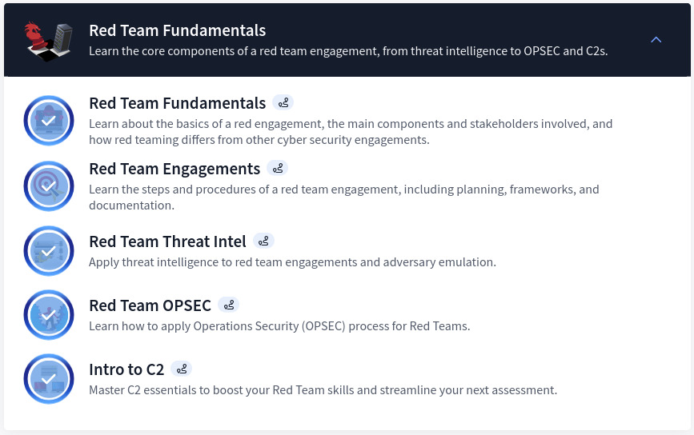
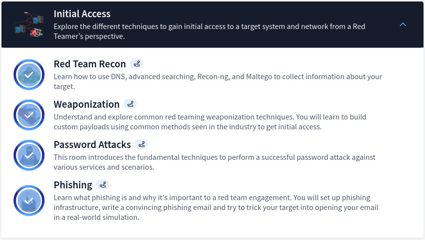
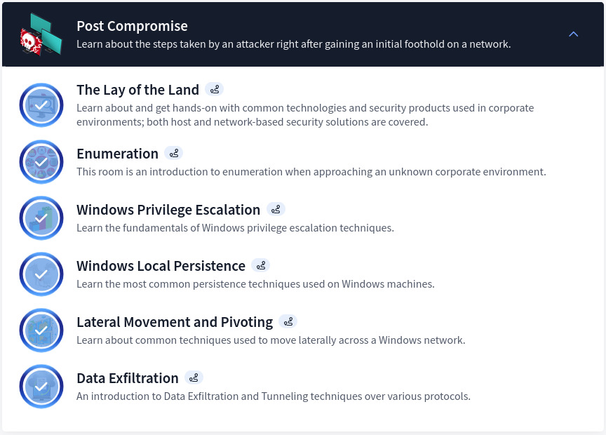
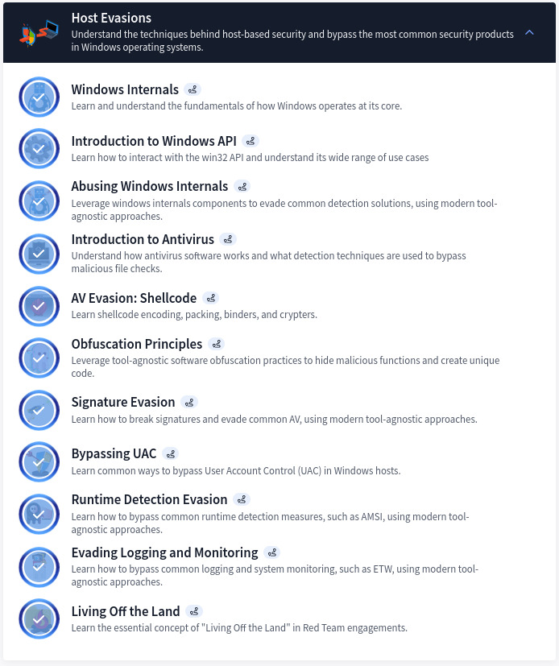
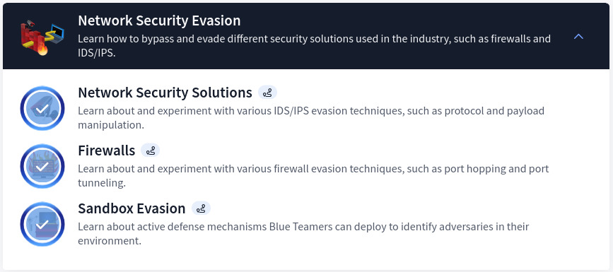
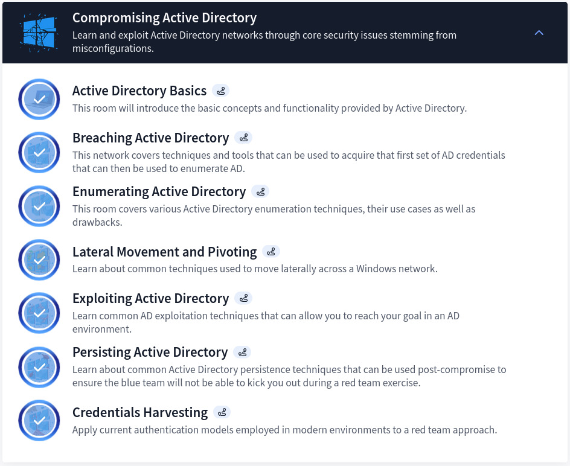

## Introduction

The Red Teaming path on TryHackMe is designed to take you beyond traditional penetration testing, immersing you in the art of adversary simulation. This pathway focuses on teaching you how to mimic real-world attackers, leveraging stealth and advanced tactics to challenge the defensive capabilities of an organization. You'll learn to navigate complex environments, bypass security controls, and maintain persistence while adhering to operational security principles.

## Section 1: Red Team Fundamentals

Introduces Red Team methodologies, OPSEC, threat intelligence, and the basics of Command and Control (C2) operations. C2 frameworks are absolutely crucial when it comes to post-exploitation and persistence — APT groups implement custom ones and use them daily.

## Section 2: Initial Access

Covers reconnaissance, weaponization, phishing, and password attacks to simulate gaining a foothold in target environments. Covers all the necessary steps to set up a stage and prepare the environment for a successful red team engagement.

## Section 3: Post Compromise

Teaches enumeration, privilege escalation, lateral movement, persistence, and exfiltration techniques. Compromising a host is one thing — maintaining persistence is another. This has been one of my favorite parts of the path.

## Section 4: Host Evasions

Focuses on bypassing AV, obfuscation, logging evasion, and Living Off the Land (LOL) tactics for stealth. Arguably the most extensive section of the path.

> **Note:** Covered in depth in HTB's [Introduction to Windows Evasion Techniques](https://academy.hackthebox.com/course/preview/introduction-to-windows-evasion-techniques).

## Section 5: Network Security Evasion

Explores methods to bypass firewalls, IDS, and sandboxes for network-level persistence. Also highlights the use of next-generation detection and prevention tools.

## Section 6: Compromising Active Directory

Guides on AD enumeration, credential harvesting, lateral movement, privilege escalation, and maintaining persistence in enterprise networks. Check out HTB, AlteredSecurity, VulnLab, and CyberWarFare Labs for more insights beyond what this path covers.

## Key Deliverables

1. **Understanding Red Team Engagements** — Red Team methodologies, threat intelligence collection, and OPSEC principles.
2. **Initial Access Techniques** — Mastery of reconnaissance, weaponization, phishing, and password attacks.
3. **Post-Compromise Skills** — Enumeration, privilege escalation, lateral movement, persistence, and data exfiltration.
4. **Evasion Techniques** — Evading endpoint defenses, shellcode obfuscation, signature evasion, LOLBins, and network evasion.
5. **Active Directory Exploitation** — AD compromise, credential harvesting, lateral movement, and persistence in enterprise environments.

## The Do's and Don'ts

### ✅ Do's

1. **Focus on Fundamentals** — Master Windows internals, Active Directory, and network security.
2. **Practice OPSEC** — Always prioritize stealth and avoid detection by defenders.
3. **Document Engagements** — Maintain detailed notes on tactics, tools, and outcomes. I use Obsidian.
4. **Test with Tools** — Use Cobalt Strike, Covenant, or custom C2 frameworks. Sliver C2 and Empire C2 are both covered.
5. **Adapt and Improvise** — Combine approaches and tailor techniques to specific environments.

### ❌ Don'ts

1. **Avoid Over-Reliance on Tools** — Understand underlying principles, not just automated outputs.
2. **Neglect Defensive Perspectives** — Knowing how Blue Teams operate makes you a better attacker.
3. **Skip Ethical Boundaries** — Always follow the Rules of Engagement (ROE) and respect the NDA.
4. **Ignore Post-Engagement Processes** — Conduct thorough cleanup after testing.

## Conclusion

This path not only teaches technical skills but also inspires the strategic mindset necessary for professional Red Teaming, equipping you to tackle advanced offensive security challenges effectively.

[View My Certificate of Completion](https://tryhackme-certificates.s3-eu-west-1.amazonaws.com/THM-FHJO9MQGNO.pdf)
